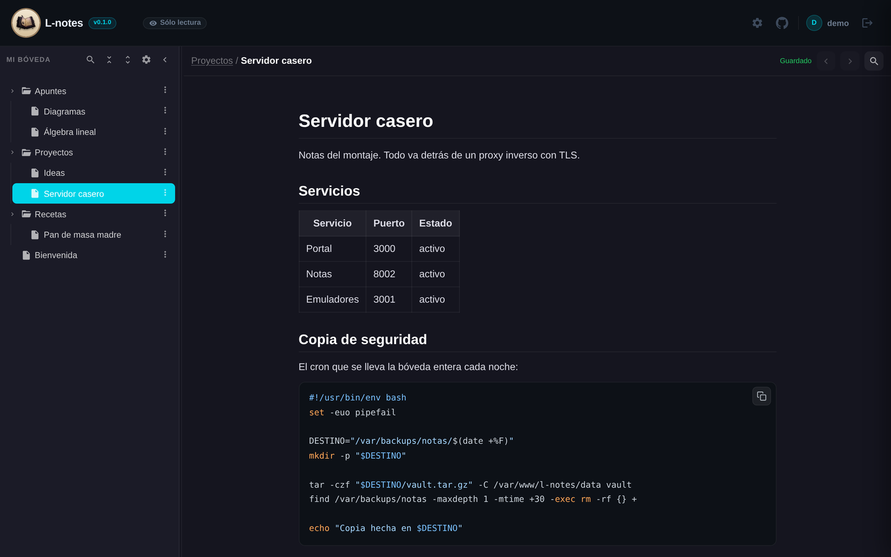
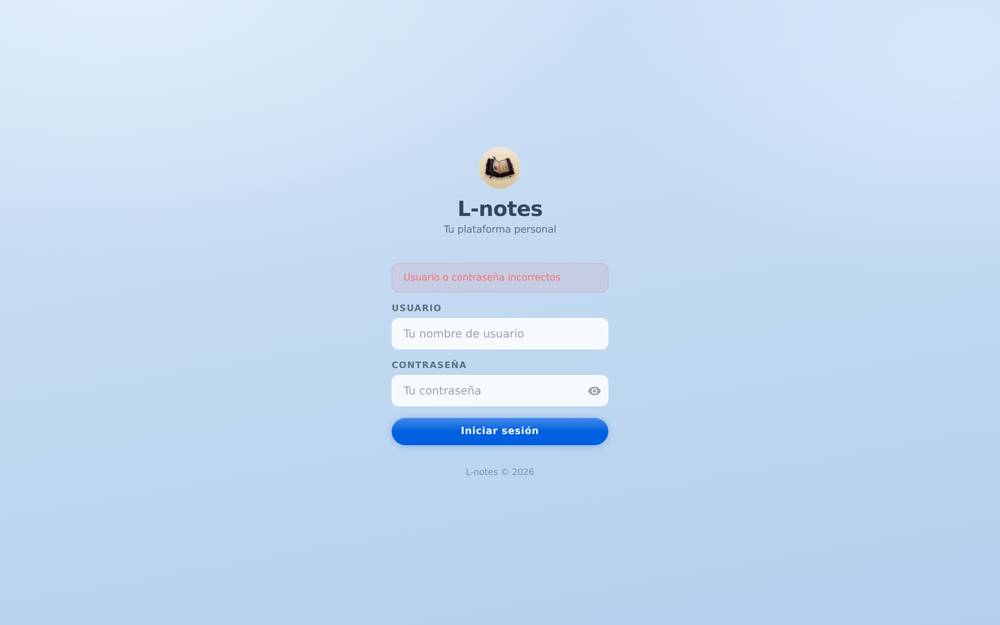
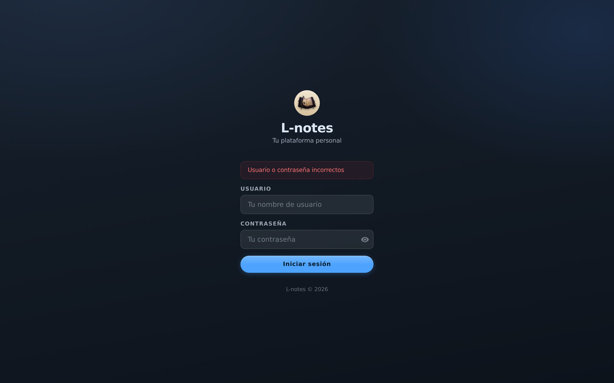
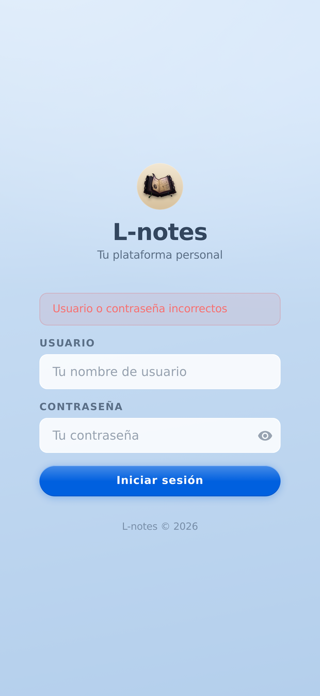
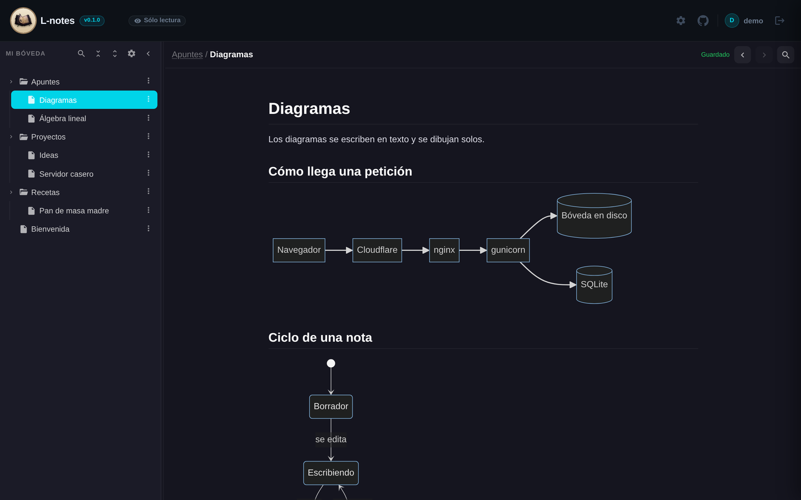
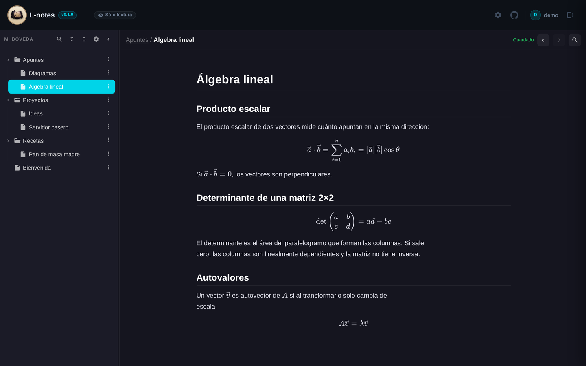
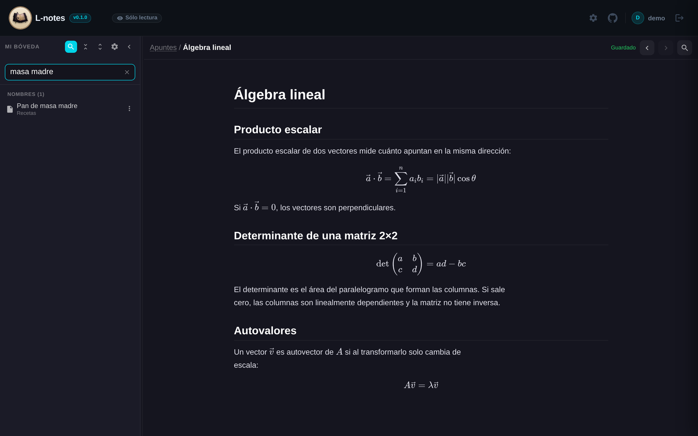
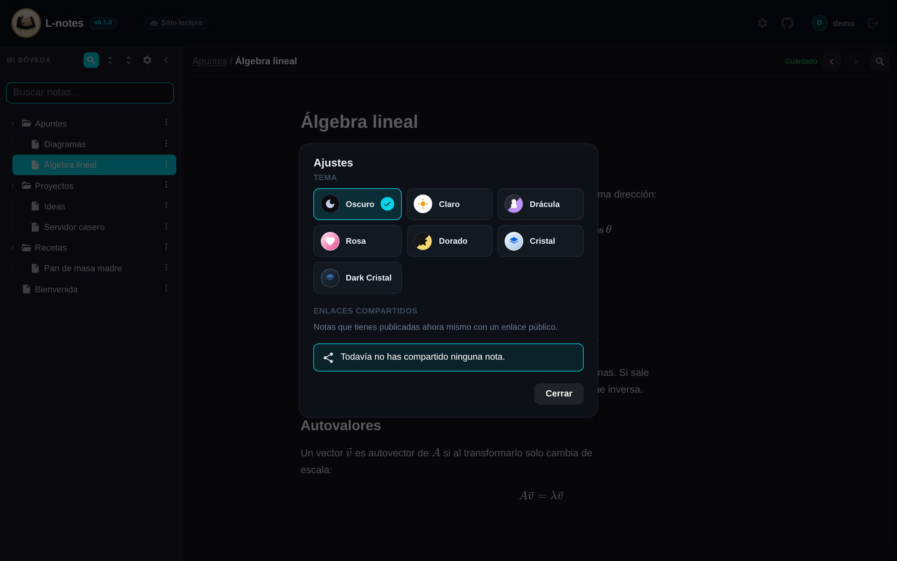
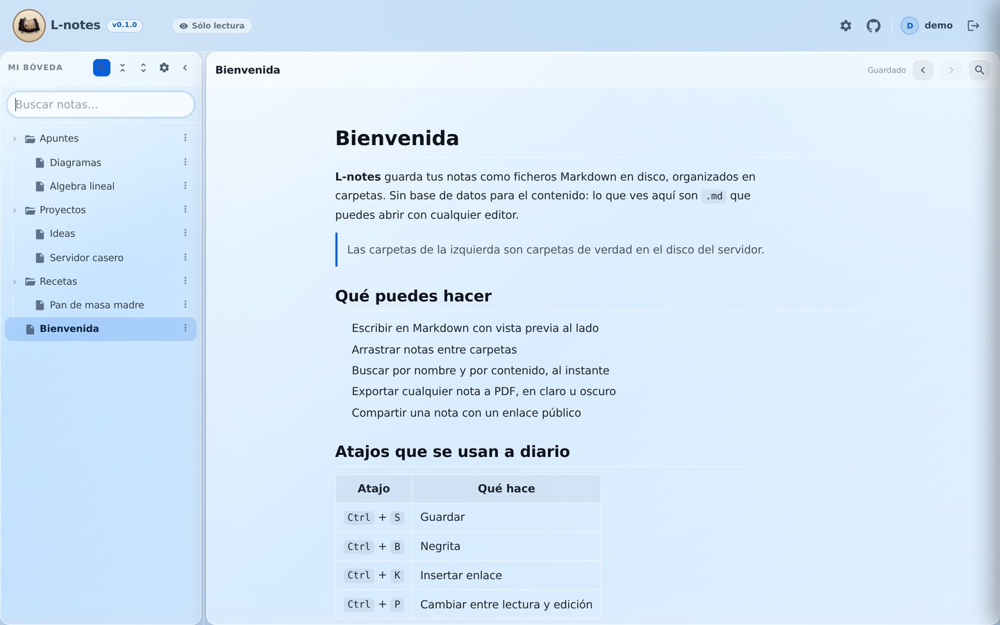
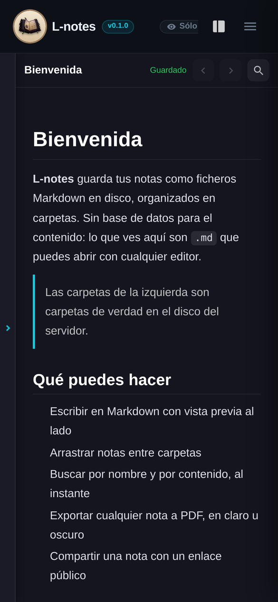

<p align="center">
  
</p>

<h1 align="center">L-notes</h1>
<p align="center">Bóveda de notas en Markdown, autoalojada y minimalista.</p>
<p align="center"><a href="https://maalfer.github.io/cogny/">maalfer.github.io/cogny</a></p>
<p align="center">
  <a href="https://github.com/pelayodesantiago98-ctrl/l-notes/releases"></a>
  <a href="LICENSE"></a>
</p>

<p align="center"></p>

> **Despliegue en producción.** Esta instancia corre en `l-notes.lepayimio.es`
> bajo gunicorn en `127.0.0.1:8002`, detrás de nginx y Cloudflare. La
> configuración del servidor (vhost, unit de systemd, certificados) vive en el
> repositorio privado `lepayimio-infra`, no aquí.

## Descripción

L-notes es una aplicación web de notas al estilo Obsidian construida con Django. Las notas viven como archivos Markdown en disco, organizadas en carpetas, sin depender de una base de datos para el contenido. Incluye editor con resaltado de código, fórmulas, diagramas, adjuntos y exportación a PDF con fidelidad completa.

## Capturas

<table>
<tr>
<td width="50%"><br><sub>Cada nota puede colgar de otra, sin límite de profundidad.</sub></td>
<td width="50%"><br><sub>Tema Cristal: superficies translúcidas sobre fondo azul.</sub></td>
</tr>
<tr>
<td width="50%"><br><sub>El mismo material, de noche.</sub></td>
<td width="50%"><br><sub>En móvil la bóveda se pliega al abrir una nota y deja un asa.</sub></td>
</tr>
</table>

<table>
<tr>
<td width="50%"><br><sub>Los diagramas se escriben en texto y se dibujan solos.</sub></td>
<td width="50%"><br><sub>Fórmulas con KaTeX, en bloque y en línea.</sub></td>
</tr>
<tr>
<td><br><sub>Búsqueda instantánea por nombre y por contenido.</sub></td>
<td><br><sub>Siete temas; el elegido queda guardado en la cuenta.</sub></td>
</tr>
<tr>
<td><br><sub>El tema cristal, en claro.</sub></td>
<td><br><sub>En el móvil, instalable como aplicación.</sub></td>
</tr>
</table>

<sub>Capturas de esta instancia, con una bóveda de ejemplo.</sub>

## Características

- Notas en Markdown organizadas en carpetas, guardadas como archivos en disco.
- **Notas anidadas**: cualquier nota puede tener subnotas, y estas las suyas, sin límite. Se crean desde el menú de la propia nota o arrastrando una encima de otra. Por dentro son carpetas con un `.md` del mismo nombre, así que la bóveda se sigue leyendo con cualquier editor.
- **Entrada única (SSO)**: la sesión la emite el portal y este servicio solo comprueba su firma. No guarda contraseñas.
- **Seis temas**, incluidos Cristal y Dark Cristal, con superficies translúcidas y desenfoque.
- **Bóveda plegable**: se recoge a un borde que sirve de asa; en móvil se pliega sola al abrir una nota.
- Editor con resaltado de sintaxis, fórmulas (KaTeX), diagramas (Mermaid) y callouts.
- Exportación de notas a PDF, con imágenes y estilos incrustados.
- Búsqueda instantánea por nombre y por contenido.
- Optimización de imágenes a WebP, al subirlas o en bloque para toda la bóveda, con backup ZIP previo opcional.
- Importación y exportación de la bóveda completa en un único ZIP.
- Progressive Web App instalable, con caché de estáticos para uso offline.

## Stack

- **Backend**: Django + gunicorn (WSGI).
- **Datos**: SQLite para cuentas y metadatos; las notas y adjuntos son archivos en disco.
- **Autenticación**: delegada en el portal por cookie firmada (HMAC-SHA256) del dominio padre. Cada cuenta guarda el identificador de esa sesión, no el nombre de usuario, de modo que renombrarse no desvincula nada.
- **Frontend**: JavaScript nativo, sin framework ni paso de compilación.
- **Exportación a PDF**: Chromium headless.

## Desarrollo local

```bash
python -m venv venv && source venv/bin/activate
pip install -r requirements.txt
cp .env.example .env   # completa DJANGO_SECRET_KEY y las rutas de datos
python manage.py migrate
python manage.py runserver
```

### Con Docker

```bash
docker compose up --build
```

Levanta L-notes en `http://localhost:8000`. Las notas, avatares y la base de datos
se persisten en `./data`. Para crear el primer usuario:

```bash
docker compose exec web python manage.py createsuperuser
```

## Despliegue

`scripts/l-notes.service` es la referencia de la unidad systemd usada en producción (gunicorn detrás de un proxy inverso con TLS). Tras cualquier cambio en los estáticos, ejecuta `collectstatic`, sube `ASSET_VERSION` en `.env` y reinicia el servicio para invalidar la caché.

## Novedades de la 0.2.0

- **Notas anidadas** al estilo CherryTree, con creación desde el menú, arrastrar y soltar, y aviso antes de borrar una rama con subnotas.
- **Entrada única** desde el portal: este servicio ya no tiene login ni contraseñas propias.
- **Identidad por ID**: cada cuenta se enlaza con un identificador que no cambia, así que renombrarse ya no obliga a mover nada.
- **Temas Cristal y Dark Cristal**.
- **Bóveda plegable** con asa, automática en móvil.
- Corregido un fallo por el que el token CSRF no llegaba y **no se podían crear notas**.

> **Actualizar desde 0.1.0 no es directo**: el login propio ha desaparecido y hace
> falta un portal que emita la sesión. Sin él, no se puede entrar.

## Créditos

L-notes está basado en **[cogny](https://github.com/Maalfer/cogny)**, de
**[Maalfer](https://github.com/Maalfer)** — el proyecto original del que parte
todo este código. Gracias por publicarlo.

Esta versión cambia la marca y añade, sobre aquella base, la entrada por SSO
desde el portal, los temas cristal y algunos ajustes de interfaz. El diseño, la
arquitectura y el grueso de la aplicación son suyos.

## Licencia

Este proyecto se distribuye bajo la **GNU General Public License v3.0**. El texto
completo está en [LICENSE](LICENSE).

    L-notes — bóveda de notas en Markdown, autoalojada
    Copyright (C) 2026 Lepayo (@pelayodesantiago98-ctrl)
    Basado en cogny, Copyright (C) Maalfer (github.com/Maalfer/cogny),
    usado y redistribuido con su permiso.

    Este programa es software libre: puedes redistribuirlo y/o modificarlo
    bajo los términos de la GNU General Public License, en su versión 3,
    tal y como la publica la Free Software Foundation.

    Se distribuye con la esperanza de que resulte útil, pero SIN NINGUNA
    GARANTÍA; ni siquiera la garantía implícita de COMERCIABILIDAD o
    IDONEIDAD PARA UN PROPÓSITO PARTICULAR. Consulta la GNU General Public
    License para más detalles.

    Deberías haber recibido una copia de la GNU General Public License junto
    a este programa. Si no es así, mírala en <https://www.gnu.org/licenses/>.

Qué significa en la práctica: puedes usarlo, estudiarlo, modificarlo y
redistribuirlo; si distribuyes una versión modificada, tienes que publicar su
código con esta misma licencia.

Las librerías de terceros de `static/vendor/` (KaTeX, Mermaid, highlight.js,
marked, Swagger UI) mantienen cada una la suya.
